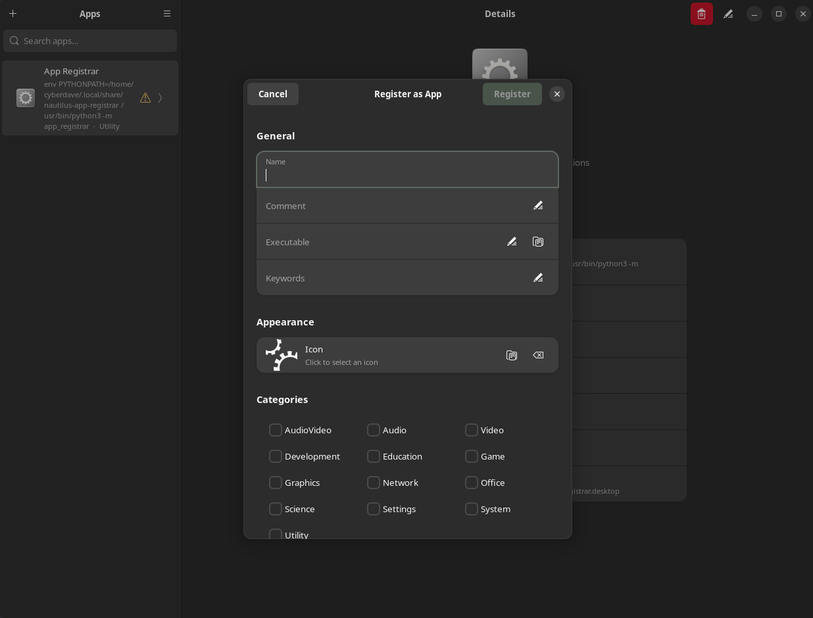

# App Registrar

Turn any executable into a launchable desktop app — right from your file manager.

App Registrar is a Nautilus extension and standalone GTK 4 app for Ubuntu that lets you register executables as proper `.desktop` applications. Right-click an executable in Nautilus, fill in a few details, and it appears in your GNOME app launcher. No terminal commands, no manual file editing, no root required.



## Features

- **Nautilus context menu** — "Register as App" appears when you right-click an executable; "Unregister App" appears if it's already registered
- **Standalone app** — browse, search, edit, and delete all your registered apps from a single window
- **Freedesktop-compliant** — generates valid `.desktop` files per the [Desktop Entry Spec](https://specifications.freedesktop.org/desktop-entry-spec/latest/)
- **GNOME-native UI** — built with GTK 4 and libadwaita, follows GNOME HIG, supports dark mode automatically
- **Undo delete** — 5-second toast with undo after removing an app
- **Broken entry detection** — warns you when a registered app's executable no longer exists
- **Keyboard shortcuts** — `Ctrl+N` new, `Ctrl+E`/`F2` edit, `Delete`/`Ctrl+Backspace` delete, `Ctrl+Q` quit
- **Configurable defaults** — set default icon, categories, and terminal behavior for new registrations
- **No root at runtime** — everything lives in `~/.local` and `~/.config`

## Installation

### Requirements

- Ubuntu 22.04 LTS or 24.04 LTS (or any distro with GNOME/Nautilus)
- Python 3
- System packages: `python3-nautilus`, `python3-gi`, `gir1.2-adw-1`

### Install

```bash
git clone https://github.com/theUpsider/app-registrar.git
cd app-registrar
./install.sh
```

The installer will:

1. Check for missing system packages and offer to install them (requires `sudo` for `apt install` only)
2. Copy the app module to `~/.local/share/nautilus-app-registrar/`
3. Install the Nautilus extension to `~/.local/share/nautilus-python/extensions/`
4. Create a `.desktop` entry so the app appears in your launcher
5. Restart Nautilus to load the extension

After installation you can open **App Registrar** from your application menu, or right-click any executable in Nautilus.

## Usage

### From Nautilus (context menu)

1. Right-click any executable file in Nautilus
2. Click **Register as App**
3. Fill in the name, optionally pick an icon and categories
4. Click **Register** — the app now appears in your GNOME launcher

To remove it later, right-click the same executable and choose **Unregister App**.

### From the standalone app

Launch **App Registrar** from your application menu. The main window shows all apps you've registered:

- **Search** — filter by name, category, or keyword
- **Add** — click `+` or press `Ctrl+N` to register a new executable
- **Edit** — select an app and click the pencil icon (or `Ctrl+E` / `F2`)
- **Delete** — select an app and click the trash icon (or `Delete` / `Ctrl+Backspace`); a toast lets you undo within 5 seconds

### Settings

Open settings from the hamburger menu. You can configure:

| Setting               | Description                                                  |
| --------------------- | ------------------------------------------------------------ |
| Default icon          | Fallback icon used when none is selected                     |
| Default categories    | Pre-checked categories for new registrations                 |
| Run in Terminal       | Whether "Run in Terminal" is checked by default              |
| Confirm before delete | Show a confirmation dialog before removing an app            |
| Show system apps      | Include non-managed `.desktop` files in the list (read-only) |

Settings are persisted to `~/.config/nautilus-app-registrar/settings.json`.

## Uninstallation

```bash
./uninstall.sh
```

The uninstaller will:

1. Remove the Nautilus extension
2. Remove the app module
3. Remove the App Registrar launcher entry
4. Optionally remove all apps you registered
5. Optionally remove configuration
6. Restart Nautilus

---

## Contributing

### Project structure

```
app-registrar/
├── nautilus_extension.py        # Nautilus context menu provider
├── install.sh                   # User-space installer
├── uninstall.sh                 # User-space uninstaller
└── app_registrar/               # Standalone GTK 4 / libadwaita app
    ├── __main__.py              # Entry point (python3 -m app_registrar)
    ├── main.py                  # Adw.Application, CLI args, global actions
    ├── window.py                # Main window — split view, list, search, undo
    ├── registration_dialog.py   # Register/edit dialog with validation
    ├── detail_view.py           # Read-only detail panel
    ├── desktop_entry.py         # .desktop file read/write/delete/query
    ├── settings_manager.py      # JSON settings persistence
    ├── settings_panel.py        # Settings preferences window
    ├── constants.py             # Paths, categories, defaults
    └── utils.py                 # Filename sanitization, exec validation, keyword generation
```

### Tech stack

- **Python 3** with PyGObject (`gi`)
- **GTK 4** + **libadwaita** for the UI
- **Nautilus 4.0 API** via `python3-nautilus` (with 3.0 compat shim)
- **freedesktop Desktop Entry Spec** for `.desktop` file generation
- `gettext` for i18n-ready strings

### Running from source

Install the system dependencies:

```bash
sudo apt install python3-nautilus python3-gi gir1.2-adw-1
```

Run the standalone app directly:

```bash
python3 -m app_registrar
```

To test the Nautilus extension, symlink it into the extensions directory:

```bash
mkdir -p ~/.local/share/nautilus-python/extensions
ln -sf "$(pwd)/nautilus_extension.py" ~/.local/share/nautilus-python/extensions/nautilus_app_registrar.py
nautilus -q
```

You'll also need `PYTHONPATH` to include the project root so the extension can import `app_registrar`:

```bash
export PYTHONPATH="$(pwd):$PYTHONPATH"
```

Then reopen Nautilus and right-click an executable.

### How it works

1. **Nautilus extension** (`nautilus_extension.py`) registers a `MenuProvider` that checks if the selected file is executable. If so, it adds a "Register as App" or "Unregister App" menu item. Both actions launch the standalone app with `--register <path>` or `--unregister <path>`.

2. **Standalone app** (`app_registrar/`) is an `Adw.Application` with a split-view window. The sidebar lists all managed `.desktop` entries (identified by `X-RegisteredBy=nautilus-app-registrar`). The content pane shows details. CRUD operations write/delete `.desktop` files and run `update-desktop-database` asynchronously.

3. **Desktop entries** are written to `~/.local/share/applications/` following the freedesktop spec. Each managed entry includes metadata keys `X-RegisteredBy` and `X-RegistrationDate` for tracking.

### Key design decisions

- **No daemon** — the extension is loaded by Nautilus on demand; the app exits when closed
- **User-space only** — all file paths are under `~/.local` and `~/.config`, no root needed at runtime
- **Manual .desktop parsing** — `configparser` mishandles `Exec=` values containing `=` signs, so entries are parsed line-by-line
- **Single instance** — `Gio.Application` ensures only one window is open at a time, with CLI args forwarded to the running instance

## License

MIT License © 2026 David Vincent Fischer. See [LICENSE](LICENSE) for details.
